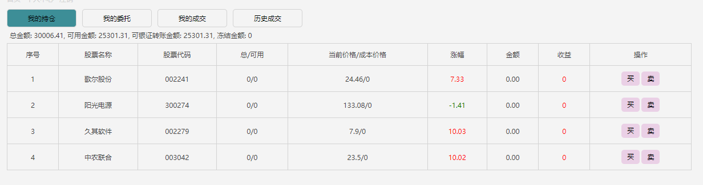
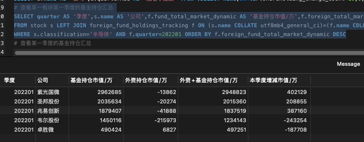

# plank 

#### Introduction

- 自动交易：集成了东方财富的自动交易接口，代码搬运来自于：https://github.com/bosspen1/stock
- 自动打板：AutomaticPlankTrading，开启plank.automaticPlankTrading=true，默认策略打10点以前涨停的首板，反包板
- 自动卖出：严格执行止损，止盈策略
- 抓取数据：A股每支股票每日的成交数据，涨跌幅度，最高最低价等等
- 监控数据：监控自己的持仓，重点关注的股票，主力实时流入
- 选股策略：找出爆量回踩的票，找出最近走上升趋势的股票等
- 晋级胜率：找出最近的连板股梯队，分析出连板股的晋级胜率，为打板提供依据

快速上手参考：src/main/resources/deployment.docx
- 自动交易从 AutomaticTrading.plank() 方法入手
- 自动打板从 AutomaticPlankTrading 入手
- 持仓数据监控从 Barbarossa.monitor() 方法入手
- 分析历史连板数据从 Barbarossa.analyzeData() 方法入手

> 请求雪球的接口报错时，去雪球首页拿一个最新的cookie换一下
> 
> 我是赛道股，趋势股，打板都玩，跟随资金，有炒大A的朋友可以加V(GODR3060W)交流
> 
> 想实现自己的选股策略就自由发挥，调用下单接口就行了，参考AutomaticTrading.buy()方法
> 
连板晋级率：

> 连板越高，晋级概率越大。三板定龙头是有道理的。当然，有可能很多都是一字板，排单都排不进去。

console->监控数据：

web页面->持仓及委托

基金和外资持仓，季度增减仓数据： sql:src/main/resources/query.text
