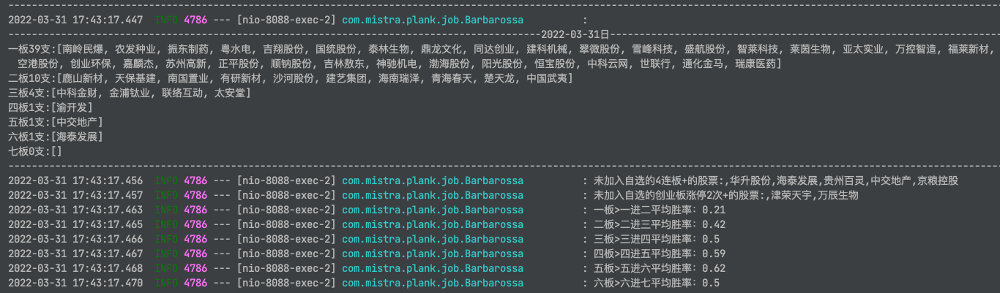

# plank 涨停先锋

#### 这个项目的目标有以下几点

- 抓取A股每支股票的数据：每日的成交数据，涨跌幅度，最高最低价等等，每日的龙虎榜数据
- 自动操盘：以历史数据为样本，配置好买入，卖出，分仓，减仓，清仓策略，自动操盘，以此来得出收益率
- 找出最近的连板股梯队，分析出连板股的晋级胜率，为打板或捉妖股提供依据

>运行之前研究一下配置文件里面的参数，特别是雪球的cookie需要隔断时间换一下
> 
> 买入标的股的选择是根据龙虎榜的净流入大小排名来决定（简单粗暴）。 因为机器不可能像我们人盯盘那样感知盘面情绪的变化。

