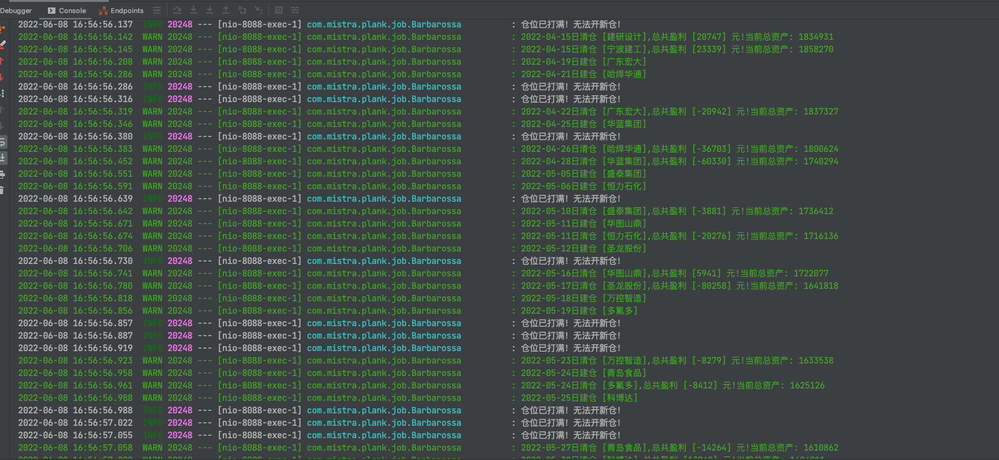
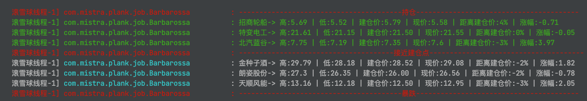

# plank 涨停先锋

#### 这个项目的目标有以下几点

- 抓取数据：A股每支股票每日的成交数据，涨跌幅度，最高最低价等等，每日的龙虎榜数据，最新北向资金持股数据
- 自动操盘：以历史数据为样本，配置好买入，卖出，分仓，减仓，清仓策略，自动操盘，以此来得出收益率
- 晋级胜率：找出最近的连板股梯队，分析出连板股的晋级胜率，为打板或捉妖股提供依据
- 统计以季报维度的主动型基金持股变动数据，数据来源于东方财富Choice数据平台导出的Excel，没去仔细研究这个平台的接口，应该有付费接口，就先将就Excel导入一下

> 运行之前研究一下配置文件里面的参数，特别是雪球的cookie需要隔断时间换一下
>
> 买入标的股的选择是根据龙虎榜的净流入大小排名来决定（简单粗暴）。 因为机器不可能像我们人盯盘那样感知盘面情绪的变化。华鑫上分量化打板YYDS，它的模型和策略是做的最好的。

连板晋级率：

> 连板越高，晋级概率越大。三板定龙头是有道理的。当然，有可能很多都是一字板，排单都排不进去。
>

以历史样本数据自动模拟操盘：

监控数据：

