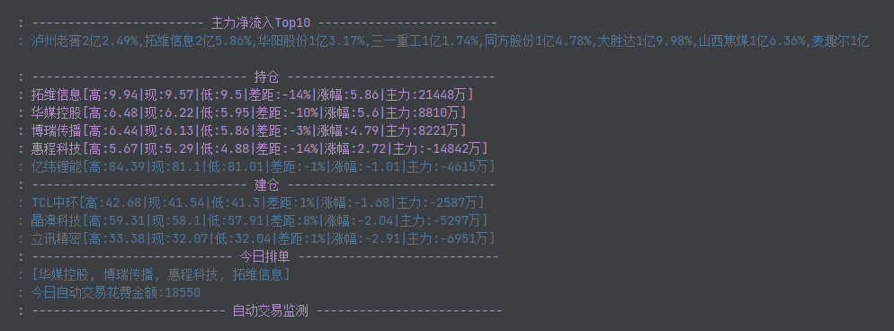

# plank 

#### 前言

癌股是个割裂的市场,九死一生!如果没有准备好,最好不要进来.如果3年还无法稳定盈利,最好离开这个市场.

全面注册制之后,打板生态明显不行了,连板数不及原来的1/3,连板高度也降低了很多.

值得参与的更多的是资金抱团走趋势的合力股,容错率更大!

#### 简介

- 自动交易：集成了东方财富的自动交易接口
- 自动打板：开启参数plank.automaticPlankTrading=true，默认策略:1.创业板首板 2.手动指定盯板标的,上板则下单排队
- 自动卖出：严格执行止损，止盈策略
- 抓取数据：A股每支股票每日的成交数据，涨跌幅度，最高最低价等等
- 监控数据：监控自己的持仓，重点关注的股票，主力实时流入
- 选股策略：找出爆量回踩的票，找出最近走上升趋势的股票等
- 晋级胜率：找出最近的连板股梯队，分析出连板股的晋级胜率，为打板提供依据

#### 入门

快速上手参考：src/main/resources/deployment.docx

- 自动打板从 AutomaticPlankTrading.AutoPlankTask 入手
- 持仓数据监控从 Barbarossa.monitor() 方法入手
- 分析历史连板数据从 Barbarossa.analyzeData() 方法入手

#### 第一原则

短线的话卖比买更重要：复盘就会发现，大的亏损都是不遵守卖出原则导致的，对分时图的下跌趋势存在幻想，幻想它会扭转下跌趋势。当然，不排除会在你卖出之后走强，但是首要原则是防止亏损，因为由赚到亏是非常伤害心态的
有4条硬性卖出原则必须执行，足以让账户回避主跌浪

- 从盈利到跌破成本 核
- 跌破止损位 核
- 跌破MA10 核
- 当日亏损达到总仓位-2.5% 核

#### tips

> 请求雪球的接口报错时，去雪球首页拿一个最新的cookie换一下
>
> 有炒大A的朋友可以加V(GODR3060W)交流
>
> 想实现自己的选股策略就自由发挥，调用下单接口就行了，参考AutomaticTrading.buy()方法
>
连板晋级率：

> 连板越高，晋级概率越大。三板定龙头是有道理的。当然，有可能很多都是一字板，排单都排不进去。

console->监控数据：

web页面->持仓及委托

